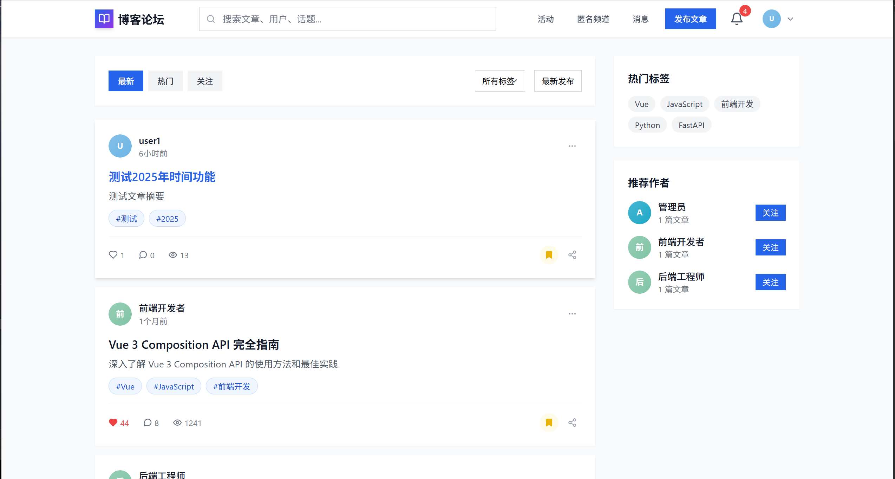
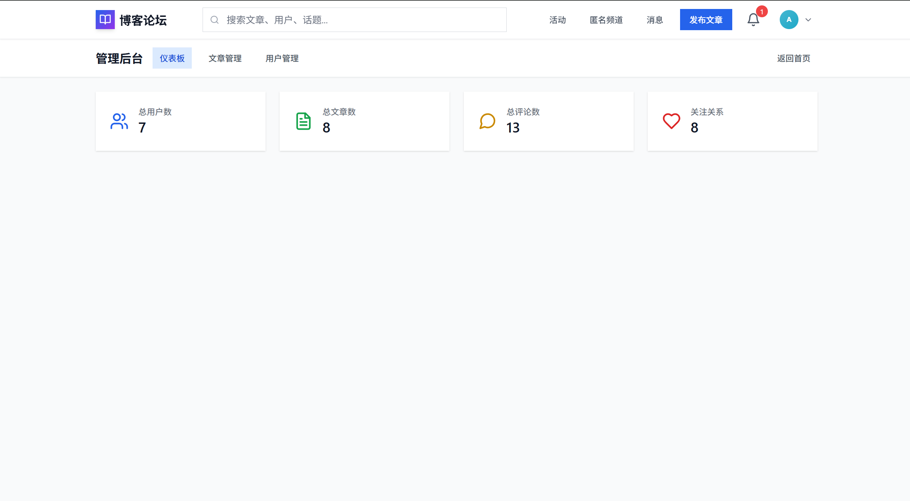

# 🌟 博客论坛系统

一个基于 Vue 3 + FastAPI 构建的现代化博客论坛系统，作为课程作业。

## 📸 项目截图





## ✨ 主要功能

### 🔐 用户系统
- ✅ 用户注册/登录
- ✅ 个人资料管理
- ✅ SVG头像系统
- ✅ 用户关注功能

### 📝 内容管理
- ✅ 文章发布/编辑/删除
- ✅ Markdown编辑器
- ✅ 文章标签系统
- ✅ 文章分类管理

### 💬 互动功能
- ✅ 评论系统（支持回复）
- ✅ 点赞/收藏功能
- ✅ 文章分享
- ✅ 通知系统

### 🔍 搜索与浏览
- ✅ 全文搜索
- ✅ 标签筛选
- ✅ 排序功能（时间、热度、点赞数）
- ✅ 分页加载

### 🛠️ 管理功能
- ✅ 管理员后台
- ✅ 用户管理
- ✅ 内容审核
- ✅ 数据统计

## 🏗️ 技术栈

### 前端
- **Vue 3** - 渐进式JavaScript框架
- **Vite** - 下一代前端构建工具
- **Vue Router** - 路由管理
- **Pinia** - 状态管理
- **Tailwind CSS** - 实用优先的CSS框架
- **Axios** - HTTP客户端
- **Lucide Vue** - 图标库

### 后端
- **FastAPI** - 现代Python Web框架
- **Uvicorn** - ASGI服务器
- **Pydantic** - 数据验证
- **JSON文件** - 数据存储（适合演示）

## 🚀 快速开始

### 环境要求
- Node.js 16+
- Python 3.8+

### 1. 克隆项目
```bash
git clone <repository-url>
cd softwareblog
```

### 2. 启动后端
```bash
cd backend
pip install -r requirements-minimal.txt
python main.py
```
后端将运行在 http://localhost:8000

### 3. 启动前端
```bash
cd frontend
npm install
npm run dev
```
前端将运行在 http://localhost:3001

### 4. 访问系统
- 前端地址：http://localhost:3001
- 后端API：http://localhost:8000
- API文档：http://localhost:8000/docs

## 👥 测试账号

| 角色 | 邮箱 | 密码 | 说明 |
|------|------|------|------|
| 管理员 | admin@blog.com | 123456 | 系统管理员 |
| 用户 | test@example.com | 123456 | 普通用户 |
| 用户 | 123@qq.com | 123456 | 新手用户 |

## 📁 项目结构

```
softwareblog/
├── frontend/                 # 前端项目
│   ├── src/
│   │   ├── api/             # API接口
│   │   ├── components/      # 组件
│   │   ├── views/           # 页面
│   │   ├── stores/          # 状态管理
│   │   └── router/          # 路由配置
│   ├── package.json
│   └── vite.config.js
├── backend/                  # 后端项目
│   ├── main.py              # 主程序
│   ├── db.json              # 数据文件
│   ├── requirements.txt     # 完整依赖
│   └── requirements-minimal.txt # 核心依赖
└── README.md                # 项目说明
```

## 🎯 核心特性

### 响应式设计
- 完美适配桌面端和移动端
- 现代化UI设计
- 流畅的用户体验

### 数据完整性
- 充实的测试数据
- 完整的用户关系
- 丰富的文章内容

### 安全性
- 用户认证系统
- 权限控制
- 数据验证

## 📝 开发说明

### 数据库设计
项目使用JSON文件作为数据存储，包含以下数据表：
- users（用户）
- posts（文章）
- comments（评论）
- tags（标签）
- likes（点赞）
- bookmarks（收藏）
- follows（关注）
- notifications（通知）

### API接口
- RESTful API设计
- 自动生成API文档
- 统一的响应格式
- 完善的错误处理

## 🤝 贡献指南

1. Fork 本仓库
2. 创建特性分支
3. 提交更改
4. 推送到分支
5. 创建 Pull Request

## 📄 许可证

本项目采用 MIT 许可证。

## 🚀 生产部署

### Linux服务器部署

本项目已优化用于Linux服务器部署，requirements.txt文件已移除版本号限制，适合生产环境。

#### 后端部署
```bash
# 1. 安装依赖（无版本限制）
pip install -r requirements.txt

# 2. 启动生产服务
uvicorn main:app --host 0.0.0.0 --port 8000 --workers 4

# 3. 使用Nginx反向代理（推荐）
# 详细配置请参考 backend/DEPLOYMENT.md
```

#### 前端部署
```bash
# 1. 构建生产版本
npm run build

# 2. 部署静态文件
# 将 dist/ 目录内容上传到web服务器
# 详细配置请参考 frontend/DEPLOYMENT.md
```

### 部署文档
- [后端部署指南](backend/DEPLOYMENT.md) - 详细的Linux服务器部署说明
- [前端部署指南](frontend/DEPLOYMENT.md) - 前端构建和部署配置

### 环境配置
- **开发环境**: 使用 `npm run dev` 和 `python main.py`
- **生产环境**: 使用 Nginx + Gunicorn/Uvicorn
- **容器化**: 支持 Docker 部署（配置文件在部署文档中）

## 🔧 系统要求

### 开发环境
- Node.js 16.0+
- Python 3.8+
- Git

### 生产环境
- Linux服务器 (Ubuntu 20.04+ / CentOS 7+)
- 1GB+ RAM (推荐 2GB+)
- 10GB+ 存储空间
- 开放端口 80/443

## 🙏 致谢

感谢augment Agent的辅助开发！

---

**🎓 这是一个课程作业项目，展示了现代Web开发的实践。**
